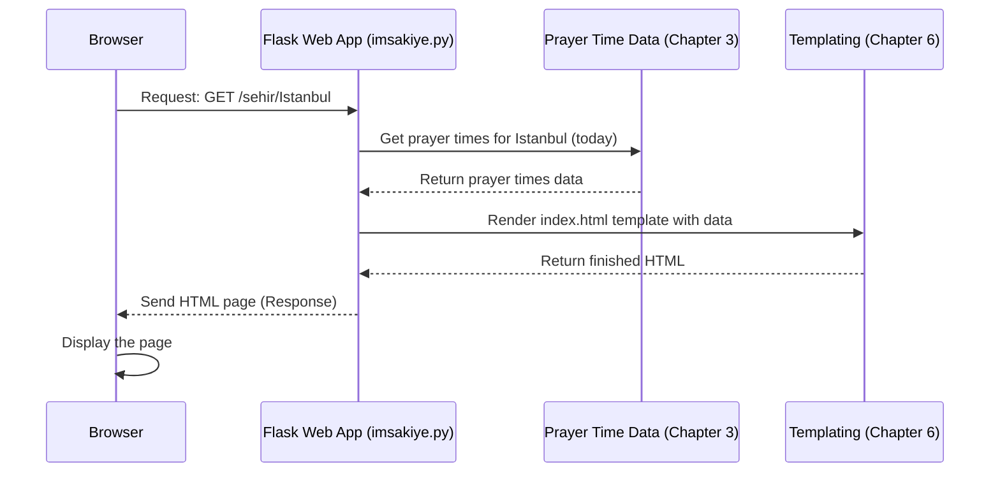

# Chapter 1: Web Application (Flask)

Welcome to the first chapter of our journey through the NamazVakitleri project! We'll start by exploring the part of the project that most people will see and interact with: the Web Application.

Think of our project as a shop. The **Web Application** is like the **storefront**. It's what welcomes visitors, shows them the products (in our case, prayer times and information), and helps them find what they need (like choosing a city).

### What is a Web Application?

A web application is simply a program that runs on a server somewhere else (not on your computer) and communicates with your web browser over the internet. When you type a website address (like google.com or imsakiye.yigitgulyurt.com) into your browser and press Enter, you're interacting with a web application!

Your browser sends a "request" to the server, and the server's web application processes that request and sends back a "response" (usually an HTML page that your browser then displays).

### What is Flask?

Building a web application from scratch can be complicated. You'd need to handle network connections, understand how web requests work, and figure out how to build dynamic web pages.

This is where **Flask** comes in! Flask is a **micro web framework** for Python. Think of a framework as a helpful toolkit that provides the basic structure and tools you need to build something. Flask gives us the essentials to create a web application quickly and easily. It handles the tricky network stuff and makes it simple to decide what happens when someone visits a specific web address on our site.

It's called "micro" because it keeps the core simple but allows you to add whatever you need. It's perfect for projects like ours!

### How Our Web Application Works (The Storefront)

Let's look at our main use case: **Showing Prayer Times for a Specific City**.

Imagine you want to see the prayer times for Istanbul.

1.  **You open the website:** Your browser sends a request to the server asking for the main page.
2.  **Choosing a City:** The website needs to know which city you want. It might show you a page to select one first.
3.  **Request for City Data:** Once you select a city (e.g., Istanbul), your browser sends another request to the server, specifically asking for the "Istanbul" prayer times page (like `imsakiye.yigitgulyurt.com/sehir/Istanbul`).
4.  **Flask Processes the Request:** The Flask application running on the server receives this request. It sees that you're asking for `/sehir/Istanbul`.
5.  **Gets the Data:** The Flask app knows it needs to get the prayer time data for Istanbul. (We'll see how it gets this data in [Chapter 3: Prayer Time Data Handling](03_prayer_time_data_handling_.md)).
6.  **Builds the Page:** Flask takes the data (Istanbul's prayer times) and uses a blueprint, called a **template**, to build the final HTML page that shows the times nicely formatted. (We'll learn more about templates in [Chapter 6: Frontend Templating](06_frontend_templating_.md)).
7.  **Sends the Page Back:** Flask sends the finished HTML page back to your browser.
8.  **Browser Displays:** Your browser receives the HTML and shows you the beautiful prayer time table for Istanbul!

### Key Concepts in Flask

Flask helps us manage steps 4, 5, 6, and 7 above. Let's look at two core ideas Flask uses:

1.  **Routes:** Routes are like the addresses or paths in our web application. They map a specific URL path (like `/`, `/sehir-secimi`, or `/sehir/Istanbul`) to a specific Python function that should handle requests for that path. In our shop analogy, `/` is the main entrance, `/sehir-secimi` is the city selection aisle, and `/sehir/Istanbul` is the shelf displaying Istanbul's times.

    Here's how a simple route looks in Flask code:

    ```python
    from flask import Flask

    app = Flask(__name__)

    @app.route('/') # This is the route decorator
    def ana_sayfa(): # This function handles requests to '/'
        return 'Welcome to the Prayer Times App!'

    # ... other code ...

    if __name__ == '__main__':
        app.run(debug=True) # This starts the Flask web server
    ```

    *   `app = Flask(__name__)` creates our Flask application instance.
    *   `@app.route('/')` is a special Flask feature called a "decorator". It tells Flask that whenever someone visits the root URL (`/`) of our website, it should run the function right below it (`ana_sayfa`).
    *   The `ana_sayfa()` function does the work and returns the content to be sent back to the browser.

    Another example from our project code:

    ```python
    @app.route('/sehir-secimi')
    def sehir_secimi():
        return render_template('sehir-secimi.html')
    ```

    This route handles requests for `/sehir-secimi` and returns an HTML page generated from a template file named `sehir-secimi.html`.

2.  **Templates:** As mentioned, templates are used to build the HTML pages that Flask sends back. Instead of writing all the HTML inside our Python code (which would be messy!), we use separate HTML files (templates). Flask uses a templating engine (Jinja2, by default) that allows us to insert dynamic information (like the prayer times or the city name) into the HTML before sending it to the browser.

    In the code snippet above, `render_template('sehir-secimi.html')` tells Flask to find the file `sehir-secimi.html` in the `templates` folder and send its content back as the response.

### Putting it Together: The `/sehir/<sehir>` Route

Let's look at a core route from our `imsakiye.py` file that handles displaying prayer times for a specific city:

```python
@app.route('/sehir/<sehir>')
def sehir_sayfasi(sehir):
    try:
        # Get prayer times for today
        bugun = datetime.now().strftime('%Y-%m-%d')
        vakitler = namaz_vakitlerini_al_sehir(sehir, bugun) # Gets data

        # Get daily content
        daily_content = get_daily_content() # Gets other data

        return render_template( # Use a template
            'index.html',
            sehir=sehir, # Pass city name to template
            vakitler=vakitler, # Pass prayer times to template
            daily_content=daily_content # Pass daily content
        )
    except Exception as e:
        return str(e), 500
```

*   `@app.route('/sehir/<sehir>')`: This route is dynamic. `<sehir>` is a variable part of the URL. If someone visits `/sehir/Istanbul`, the value of `sehir` inside the function will be "Istanbul". If they visit `/sehir/Ankara`, it will be "Ankara".
*   `def sehir_sayfasi(sehir):`: The function accepts the `sehir` value from the URL.
*   `vakitler = namaz_vakitlerini_al_sehir(sehir, bugun)`: This line calls another function to get the actual prayer time data for the given `sehir` and the current date (`bugun`). (We'll explore `namaz_vakitlerini_al_sehir` in [Chapter 3: Prayer Time Data Handling](03_prayer_time_data_handling_.md)).
*   `daily_content = get_daily_content()`: This gets some extra content to display on the page. (More on this in [Chapter 7: Daily Content Provider](07_daily_content_provider_.md)).
*   `return render_template('index.html', ...)`: This is the crucial part. It tells Flask to use the `index.html` template file. It also passes the `sehir` name, `vakitler` data, and `daily_content` to the template. The template then uses this information to fill in the blanks and create the final HTML page. (See [Chapter 6: Frontend Templating](06_frontend_templating_.md) for how templates use this data).

### The Request-Response Flow (Simplified)

Let's visualize the simple flow when a user visits `/sehir/Istanbul`:



This diagram shows the simple steps: the browser asks Flask for a page, Flask asks the Data Handler for information, uses the Templating Engine to format it, and sends it back to the browser.

### Where to find the Code

All the core Flask application code is within the `imsakiye.py` file. You can see the routes defined using `@app.route(...)` and the use of `render_template(...)` to display pages.

The HTML template files are located in the `templates/` directory. For example, the code above uses `templates/index.html`.

### Conclusion

In this chapter, we learned that the Web Application, built with Flask, is the welcoming "storefront" of our project. It receives requests from users' browsers, uses **routes** to figure out what to do, fetches necessary data (we'll see how later), and uses **templates** to build the HTML pages that users see.

We saw how Flask provides the basic structure for handling web requests and generating responses, making it easier to build interactive websites like our prayer times display.

Next, we'll look at another part of the project that also interacts with users, but in a different way: the Telegram Bot.

[Telegram Bot Application](02_telegram_bot_application_.md)

---

<sub><sup>**References**: [[1]](https://github.com/yigitgulyurt/NamazVakitleri/blob/86f03bb599f007d4f20d1af54233bfd8de16b1d4/imsakiye.py), [[2]](https://github.com/yigitgulyurt/NamazVakitleri/blob/86f03bb599f007d4f20d1af54233bfd8de16b1d4/templates/index.html), [[3]](https://github.com/yigitgulyurt/NamazVakitleri/blob/86f03bb599f007d4f20d1af54233bfd8de16b1d4/templates/offline.html), [[4]](https://github.com/yigitgulyurt/NamazVakitleri/blob/86f03bb599f007d4f20d1af54233bfd8de16b1d4/templates/open_in_browser.html), [[5]](https://github.com/yigitgulyurt/NamazVakitleri/blob/86f03bb599f007d4f20d1af54233bfd8de16b1d4/templates/privacy_policy.html), [[6]](https://github.com/yigitgulyurt/NamazVakitleri/blob/86f03bb599f007d4f20d1af54233bfd8de16b1d4/templates/sehir-secimi.html), [[7]](https://github.com/yigitgulyurt/NamazVakitleri/blob/86f03bb599f007d4f20d1af54233bfd8de16b1d4/templates/stats.html), [[8]](https://github.com/yigitgulyurt/NamazVakitleri/blob/86f03bb599f007d4f20d1af54233bfd8de16b1d4/templates/tam_ekran.html)</sup></sub>
