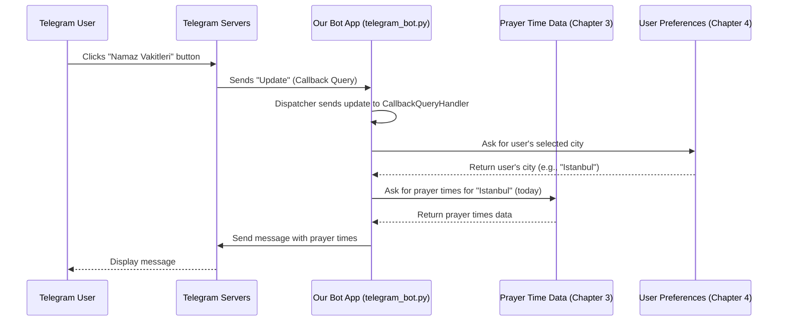

# Chapter 2: Telegram Bot Application

Welcome back! In [Chapter 1: Web Application (Flask)](01_web_application__flask__.md), we explored how our project presents prayer times and information through a website, acting like a digital storefront. Now, we're going to look at another way users can interact with NamazVakitleri: through a friendly chat assistant inside the Telegram app!

### What is a Telegram Bot Application?

Imagine you have a helpful assistant living inside your Telegram app. You can chat with it, ask it questions, and it replies instantly. That's essentially what a **Telegram Bot Application** is.

It's a separate program specifically designed to run on a server and communicate directly with users via Telegram's chat interface. Unlike a website you visit with a browser, you interact with a bot by sending messages, commands, or clicking buttons right within a Telegram chat window.

Our Telegram Bot application for NamazVakitleri is like this helpful assistant. It listens for your requests (like asking for prayer times), remembers your settings (like which city you live in, covered in [Chapter 4: User City and Preference Storage](04_user_city_and_preference_storage_.md)), fetches the information you need (like prayer times from [Chapter 3: Prayer Time Data Handling](03_prayer_time_data_handling_.md)), and sends polite messages or timely reminders back to you in the chat.

### Why Have a Telegram Bot?

You might ask, "If we have a website, why do we need a bot?". Good question! A bot offers different benefits:

*   **Convenience:** Get information quickly without opening a web browser.
*   **Notifications:** Bots can proactively send you reminders (like upcoming prayer times, covered in [Chapter 8: Scheduled Notification System](08_scheduled_notification_system_.md)).
*   **Direct Interaction:** It feels more personal and conversational.

### Our Bot's Core Job: Providing Prayer Times

Let's think about a central use case for our bot: **A user asks for prayer times for their city.**

Here's a simplified idea of how this interaction might go in Telegram:

1.  **User:** (Types something or clicks a button asking for prayer times)
2.  **Bot:** "Okay, which city are you interested in? (Or: Here are the times for [Your City])."
3.  **User:** (Tells the bot their city, maybe they already set it up)
4.  **Bot:** (Looks up the prayer times for that city, like in [Chapter 3: Prayer Time Data Handling](03_prayer_time_data_handling_.md))
5.  **Bot:** "Here are today's prayer times for [City Name]: Imsak: HH:MM, Güneş: HH:MM, etc."

To make this happen, our bot application needs to be constantly listening for messages and requests from Telegram.

### How Our Bot Listens and Responds

Building a Telegram bot from scratch, understanding Telegram's communication system, is complicated. Thankfully, just like Flask helps with web apps, there are libraries for building Telegram bots in Python! Our project uses the `python-telegram-bot` library.

Think of `python-telegram-bot` as a toolkit that makes connecting to Telegram and handling messages much easier.

Here are a few key ideas this library helps us with:

1.  **Updates:** When someone sends a message, clicks a button, or interacts with the bot in any way, Telegram sends an "Update" to our bot application. An update is like a notification saying, "Hey, something happened!"
2.  **Handlers:** Our bot application needs to know what to *do* with different types of updates. Handlers are like specialized receivers. We set up different handlers to listen for different things:
    *   A `CommandHandler` listens for messages starting with `/` (like `/start`).
    *   A `MessageHandler` listens for regular text messages.
    *   A `CallbackQueryHandler` listens for clicks on interactive buttons attached to messages.
3.  **Dispatcher:** This is the central part that receives all incoming updates and sends them to the correct handler. It's like the post office sorting mail to the right person.
4.  **Application:** This is the main object that holds everything together – the connection to Telegram, the dispatcher, and all the handlers we set up.

### Building the Interaction: A Simple Flow

Let's trace the flow for our core use case: a user wants to see prayer times after they have already set their city. They might click a button labeled "Namaz Vakitleri".



This diagram shows how the bot receives the button click, finds the user's settings ([Chapter 4](04_user_city_and_preference_storage_.md)), gets the data ([Chapter 3](03_prayer_time_data_handling_.md)), and sends a response back through Telegram's servers.

### Setting Up the Bot and Handlers (Simplified Code)

Let's look at some simplified examples from `telegram_bot.py` to see how this is done using `python-telegram-bot`.

First, we need to create the bot `Application`:

```python
from telegram.ext import Application, CommandHandler, MessageHandler, filters, CallbackQueryHandler
# ... other imports ...

TOKEN = 'YOUR_BOT_TOKEN_HERE' # This is your unique bot token from Telegram

def main():
    # Create the Application and pass your bot's token.
    application = Application.builder().token(TOKEN).build()

    # ... add handlers here ...

    # Run the bot until the user presses Ctrl+C
    application.run_polling()

if __name__ == '__main__':
    main()
```

This code creates the main bot object and starts it listening for updates using `run_polling()`. The `TOKEN` is essential – you get this from Telegram when you create a bot.

Next, we define functions that will handle specific commands or messages, and then we add "handlers" to the `application` to connect those functions to incoming updates.

Here's a simple handler for the `/start` command:

```python
# Inside main():
async def start(update, context):
    """Handles the /start command"""
    await update.message.reply_text(
        '🕌 Welcome to the Prayer Times Bot!\n\n'
        'Use the buttons below to get started.',
        reply_markup=get_main_keyboard() # get_main_keyboard creates buttons
    )

# Inside main() after creating application:
application.add_handler(CommandHandler("start", start))
```

*   `async def start(update, context):` This defines the function that runs when the `/start` command is received. It takes `update` (details about the incoming message) and `context` (useful information and tools) as arguments.
*   `await update.message.reply_text(...)`: This is how the bot sends a text message back to the user in the same chat. `await` is used because sending messages over the internet takes a moment.
*   `reply_markup=get_main_keyboard()`: This attaches interactive buttons to the message. We define functions like `get_main_keyboard()` to create these button layouts.

To handle clicks on those buttons, we use a `CallbackQueryHandler`:

```python
# Inside main():
async def button_callback(update, context):
    """Handles button clicks"""
    query = update.callback_query # Get the details of the button click
    await query.answer() # Tell Telegram the click was received

    if query.data == "vakitler": # Check which button was clicked based on its data
        # ... Logic to get and show prayer times ...
        sehir = "Istanbul" # Simplified: Get this from user settings (Chapter 4)
        bugun = datetime.now().strftime('%Y-%m-%d')
        prayer_times = namaz_vakitlerini_al_sehir(sehir, bugun) # Get data (Chapter 3)

        message = f"📅 Today's Prayer Times ({sehir}):\n\n"
        message += f"🌅 Imsak: {prayer_times['imsak']}\n"
        # ... add other times ...

        await query.edit_message_text(text=message) # Edit the message to show times

# Inside main() after creating application:
application.add_handler(CallbackQueryHandler(button_callback))
```

*   `async def button_callback(update, context):` This function runs when any button attached to a message is clicked.
*   `query = update.callback_query`: Accesses the specific data sent by the button click.
*   `await query.answer()`: A small pop-up confirmation for the user in Telegram.
*   `if query.data == "vakitler":`: Buttons have a `callback_data` value (like "vakitler") that tells our code *which* button was clicked.
*   `namaz_vakitlerini_al_sehir(sehir, bugun)`: This is where we use the function from [Chapter 3: Prayer Time Data Handling](03_prayer_time_data_handling_.md) to fetch the data.
*   `await query.edit_message_text(text=message)`: Updates the original message with the prayer times, rather than sending a new one.

We also have a `MessageHandler` to process regular text, like if a user types a city name:

```python
# Inside main():
async def handle_message(update, context):
    """Handles incoming text messages"""
    text = update.message.text
    
    if text in SEHIRLER: # Simplified: Check if the text is a valid city
        # ... Save the user's chosen city in the database ... (Chapter 4)
        selected_city = text
        await update.message.reply_text(f"✅ {selected_city} city selected!")
    # ... handle other text messages ...

# Inside main() after creating application:
application.add_handler(MessageHandler(filters.TEXT & ~filters.COMMAND, handle_message))
```

*   `async def handle_message(update, context):` This function runs for most incoming text messages that are *not* commands.
*   `filters.TEXT & ~filters.COMMAND`: This tells the handler to only process messages that are text and *not* starting with `/`.
*   `if text in SEHIRLER:`: A simple check to see if the text matches one of our known cities.
*   `await update.message.reply_text(...)`: Sends a confirmation message back.

### Where to find the Code

All the code for the Telegram Bot application is located in the `telegram_bot.py` file. You'll find the `main` function setting up the `Application`, the `add_handler` calls, and the `async` functions like `start`, `handle_message`, `button_callback`, etc., which define how the bot responds to different user actions.

You'll also see functions like `get_main_keyboard()` that create the button layouts shown to the user.

The interaction with saving user preferences (like chosen city) is handled by interacting with a database within this file, which will be detailed further in [Chapter 4: User City and Preference Storage](04_user_city_and_preference_storage_.md). The scheduled notifications are also set up here but rely on a separate job queue, explained in [Chapter 8: Scheduled Notification System](08_scheduled_notification_system_.md).

### Conclusion

In this chapter, we learned that the Telegram Bot application is a chat-based assistant for our project, running within the Telegram app. It uses the `python-telegram-bot` library to receive **Updates** from Telegram users (like messages, commands, or button clicks) and uses **Handlers** to direct these updates to specific Python functions. These functions then process the request (getting data from other parts of the application, like [Chapter 3: Prayer Time Data Handling](03_prayer_time_data_handling_.md) or [Chapter 4: User City and Preference Storage](04_user_city_and_preference_storage_.md)) and send responses back to the user in the chat.

We saw how simple handlers for commands and button clicks are set up and how the bot sends messages or updates them.

Next, we'll dive into the crucial part of the project: where and how we get the actual Prayer Time data!

[Prayer Time Data Handling](03_prayer_time_data_handling_.md)

---

<sub><sup>Generated by [AI Codebase Knowledge Builder](https://github.com/The-Pocket/Tutorial-Codebase-Knowledge).</sup></sub> <sub><sup>**References**: [[1]](https://github.com/yigitgulyurt/NamazVakitleri/blob/86f03bb599f007d4f20d1af54233bfd8de16b1d4/telegram_bot.py)</sup></sub>
