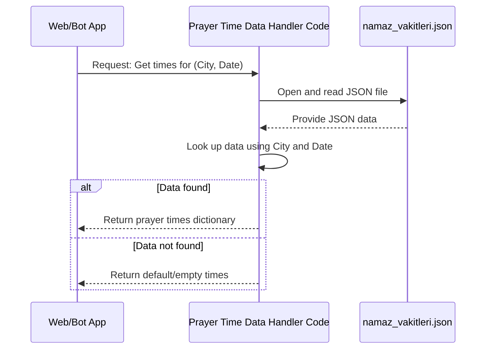

# Chapter 3: Prayer Time Data Handling

Welcome back to our journey through the NamazVakitleri project! In the previous chapters ([Chapter 1: Web Application (Flask)](01_web_application__flask__.md) and [Chapter 2: Telegram Bot Application](02_telegram_bot_application_.md)), we explored the different ways users can interact with our application – through a website and a Telegram chat bot. Both of these interfaces have one main job: showing prayer times!

But where do these prayer times actually *come from*? They don't magically appear! We need a reliable source for this data and a way to access it.

### What Problem Are We Solving?

Imagine you have a large, physical "imsakiye" book – the kind that lists prayer times for many cities for every day of the year. If someone asks you, "What is the sunset time in Istanbul today?", you'd need to:

1.  Find the section for Istanbul.
2.  Turn to today's date.
3.  Look at the row for "Akşam" (sunset).
4.  Read the time and tell them.

This is exactly the problem our project needs to solve digitally. The **Prayer Time Data Handling** part of the project is like our digital "imsakiye bookkeeper". It holds the vast list of prayer times and is responsible for finding and providing the correct time whenever the Web Application or the Telegram Bot asks for it.

### The Role of the Prayer Time Data Handler

This part of the code acts as a central source of truth for prayer times. Its main responsibilities are:

*   Knowing where the prayer time data is stored.
*   Reading and understanding that data.
*   Looking up the specific prayer times for a given city and date.
*   Providing this information back to other parts of the application.

Think of it as a dedicated library or service within our project that other parts call when they need prayer time information.

### Where Does the Data Come From?

In our NamazVakitleri project, the prayer time data is stored in a file. Specifically, it's kept in a **JSON file**.

*   **What is a JSON file?** JSON (JavaScript Object Notation) is a simple format for storing and exchanging data. It's easy for both humans to read and computers to parse. Think of it like a structured notebook where information is organized using labels (keys) and values. It's a very common way to store data that doesn't change often.

Our project uses a file named `static/namaz_vakitleri.json`. This file contains the prayer times for various cities for a range of dates, structured like a nested dictionary (or a nested list of labels and values). The structure roughly looks like this inside the file:

```json
{
  "Istanbul": {
    "2025-03-01": {
      "imsak": "05:30",
      "gunes": "06:55",
      "ogle": "12:45",
      "ikindi": "15:50",
      "aksam": "18:30",
      "yatsi": "19:45"
    },
    "2025-03-02": {
      "imsak": "05:28",
      "gunes": "06:53",
      "ogle": "12:45",
      "ikindi": "15:51",
      "aksam": "18:31",
      "yatsi": "19:46"
    }
    // ... more dates for Istanbul ...
  },
  "Ankara": {
    "2025-03-01": {
      "imsak": "05:20",
      "gunes": "06:45",
      "ogle": "12:35",
      "ikindi": "15:40",
      "aksam": "18:20",
      "yatsi": "19:35"
    },
    // ... more dates for Ankara ...
  }
  // ... more cities ...
}
```

You can see it's organized by city, then by date, and then lists the times for each prayer.

### How it Works: Getting Prayer Times for a City and Date

The core task of the Prayer Time Data Handling is to take a city name and a date (like "Istanbul" and "2025-03-01") and return the dictionary containing the prayer times for that specific entry.

Let's trace the simple steps involved when another part of the application (like the Flask Web App from [Chapter 1](01_web_application__flask__.md)) asks for data:



As you can see, the process is straightforward: the caller asks the Data Handler, the Handler reads the data source, finds the specific information, and gives it back.

### The Code: The `namaz_vakitlerini_al_sehir` Function

In our project, the main function responsible for this task for cities is `namaz_vakitlerini_al_sehir`. It takes the `sehir` (city) name and optionally a `tarih` (date) as input.

Let's look at simplified pieces of the `namaz_vakitlerini_al_sehir` function from the `imsakiye.py` file:

```python
import json
import os
from datetime import datetime # Need this for current date/formatting

# (Other imports and Flask app setup are here...)

# APP_ROOT variable helps find the file path
APP_ROOT = os.path.dirname(os.path.abspath(__file__))

def namaz_vakitlerini_al_sehir(sehir, tarih=None):
    try:
        # 1. Find the full path to the JSON file
        json_dosya_yolu = os.path.join(APP_ROOT, 'static/namaz_vakitleri.json')

        # (Code to get current date if tarih is None is here...)
        # (Code to check if file exists is here...)

        # 2. Open and read the JSON file
        with open(json_dosya_yolu, 'r', encoding='utf-8') as file:
            vakitler_data = json.load(file)

        # 3. Look up the data for the given city and date
        date_str = tarih # Assuming tarih is already a string like "YYYY-MM-DD"
        if sehir in vakitler_data and date_str in vakitler_data[sehir]:
            # Data found! Return the dictionary of times
            return vakitler_data[sehir][date_str]
        else:
            # Data not found for this city or date
            print(f"Veri bulunamadı: {sehir}, {date_str}")
            return { # Return default placeholder times
                'imsak': '--:--', 'gunes': '--:--', 'ogle': '--:--',
                'ikindi': '--:--', 'aksam': '--:--', 'yatsi': '--:--'
            }
    except Exception as e:
        # Handle any errors during file reading or lookup
        print(f"Hata: {e}")
        return { # Return default placeholder times in case of error
            'imsak': '--:--', 'gunes': '--:--', 'ogle': '--:--',
            'ikindi': '--:--', 'aksam': '--:--', 'yatsi': '--:--'
        }
```

Let's break down the key parts:

1.  **Finding the File:** `os.path.join(APP_ROOT, 'static/namaz_vakitleri.json')` figures out the exact location of the JSON file relative to where the script is running. `APP_ROOT` is a variable defined earlier in the file that holds the path to the project's main directory.
2.  **Reading the Data:** `with open(...) as file:` opens the file. `json.load(file)` reads the entire content of the file and converts it into a Python dictionary (or list, depending on the JSON structure). Now, the `vakitler_data` variable in the code holds all the prayer time information that was in the JSON file.
3.  **Looking Up the Times:** The line `if sehir in vakitler_data and date_str in vakitler_data[sehir]:` checks if the `sehir` (city) exists as a key in the main dictionary, and if the `date_str` exists as a key within the dictionary for that city. If both are found, it means we have the data!
4.  **Returning the Result:** If the data is found, `vakitler_data[sehir][date_str]` accesses the nested dictionary containing the prayer times for that specific city and date, and this dictionary is returned by the function. If the data isn't found (or if there's an error), the function returns a dictionary with placeholder times (`--:--`) so the rest of the application doesn't crash.

This function is essentially performing the "lookup" operation in our digital imsakiye book.

There's also a similar function `namaz_vakitlerini_al_ulke` for fetching data based on country, used for displaying non-Turkish prayer times if available in the JSON, but the principle is the same: read the JSON and look up the requested data.

### Connecting to Other Parts

This `namaz_vakitlerini_al_sehir` function is called by other parts of the application:

*   In [Chapter 1: Web Application (Flask)](01_web_application__flask__.md), the `/sehir/<sehir>` route calls this function to get the data needed to display the web page for a specific city.
*   In [Chapter 2: Telegram Bot Application](02_telegram_bot_application_.md), the `vakitler` function (which handles requests for prayer times) calls this function to fetch the times before formatting them into a Telegram message.
*   The API endpoint `/api/namaz_vakitleri` also calls this function to provide prayer times in JSON format to external requests (covered in [Chapter 5: Backend API Endpoints](05_backend_api_endpoints_.md)).
*   The scheduled notification system ([Chapter 8: Scheduled Notification System](08_scheduled_notification_system_.md)) also relies on this function to get the upcoming prayer times to know when to send reminders.

So, the Prayer Time Data Handler is a crucial piece that serves data to many other parts of the application.

### Where to find the Code

You can find the `namaz_vakitlerini_al_sehir` (and `namaz_vakitlerini_al_ulke`) function definitions and the logic for reading the JSON file within the `imsakiye.py` file.

The actual prayer time data is stored in the `static/namaz_vakitleri.json` file.

### Conclusion

In this chapter, we learned that the **Prayer Time Data Handling** component is like the project's "imsakiye bookkeeper". Its main job is to read prayer time data from a source (the `static/namaz_vakitleri.json` file) and provide the specific times needed for a given city and date. We saw how the `namaz_vakitlerini_al_sehir` function reads the JSON file and performs the necessary lookup.

This component is essential because it isolates the data access logic, making it easy for any part of the application (Web, Bot, API, Notifications) to get the prayer times they need without worrying about *how* the data is stored or read.

Now that we know how to get the prayer times, the next question is: how does the application know *which* city the user wants to see times for? We'll explore this in the next chapter!

[User City and Preference Storage](04_user_city_and_preference_storage_.md)

---

<sub><sup>Generated by [AI Codebase Knowledge Builder](https://github.com/The-Pocket/Tutorial-Codebase-Knowledge).</sup></sub> <sub><sup>**References**: [[1]](https://github.com/yigitgulyurt/NamazVakitleri/blob/86f03bb599f007d4f20d1af54233bfd8de16b1d4/imsakiye.py), [[2]](https://github.com/yigitgulyurt/NamazVakitleri/blob/86f03bb599f007d4f20d1af54233bfd8de16b1d4/static/data/daily_content.json), [[3]](https://github.com/yigitgulyurt/NamazVakitleri/blob/86f03bb599f007d4f20d1af54233bfd8de16b1d4/telegram_bot.py)</sup></sub>
