# Chapter 4: User City and Preference Storage

Welcome back! In the last chapter, [Chapter 3: Prayer Time Data Handling](03_prayer_time_data_handling_.md), we learned how our application gets the actual prayer times from a data file. We saw how the Web Application ([Chapter 1](01_web_application__flask__.md)) and the Telegram Bot ([Chapter 2](02_telegram_bot_application_.md)) ask for this data using functions like `namaz_vakitlerini_al_sehir`.

But wait, how does the application know *which* city's prayer times you want to see? How does the Telegram bot know if you want notifications, and how many minutes before the prayer they should arrive?

This is where **User City and Preference Storage** comes in.

### What Problem Are We Solving?

Imagine visiting a website or talking to a bot, and every single time it asks you, "What city are you in?" or "Do you want notifications?". That would be annoying!

We need a system that remembers your choices. Just like a website remembers your login or items in your shopping cart, our NamazVakitleri application needs a memory for *each user*.

This part of the project is essentially creating a simple "user profile" for every person who uses the Telegram bot. It saves:

1.  Your preferred city.
2.  Whether you want prayer time notifications enabled.
3.  How many minutes before the prayer time the notification should arrive (e.g., 5, 10, or 15 minutes).

This way, the next time you ask the bot for prayer times or when it's time to send a notification, it instantly knows your settings without having to ask you again.

### How Does it Remember? Using a Database!

To remember things about individual users persistently (meaning the data stays saved even if the application restarts), we need a place to store this information. For our Telegram bot, we use a simple **database**.

Think of a database like a smart digital filing cabinet or a spreadsheet that the bot can quickly read from and write to. Each user gets their own row in a specific "sheet" or "table".

Our Telegram bot uses **SQLite**, which is a very simple, file-based database. It stores all the user data in a single file named `telegram_bot.db`. It's easy to set up and use for smaller applications like this bot.

### The User's Profile Table (`users`)

Inside the `telegram_bot.db` file, we create a "table" specifically for storing user information. Let's call this table `users`.

Each row in the `users` table represents a single user and has columns (like columns in a spreadsheet) to store their preferences:

| Column Name         | What it Stores                             | Example Data      |
| :------------------ | :----------------------------------------- | :---------------- |
| `user_id`           | A unique number for each Telegram user     | 123456789         |
| `sehir`             | The user's chosen city                     | "İstanbul"        |
| `bildirim_aktif`    | Is notification active? (1 for Yes, 0 for No) | 1                 |
| `bildirim_suresi`   | Minutes before prayer time to notify       | 10                |
| `grup_id`           | If in a group, the group chat ID (optional) | -1001234567890    |
| `arkadas_onerisi` | Another preference (less relevant here)    | 0                 |

This table structure provides a clear way to store and retrieve the settings for any specific user based on their unique `user_id`.

### How it Works: Saving and Getting Preferences

Let's trace what happens when a user changes a setting, like selecting a city or enabling notifications, and how the bot later retrieves this information.

Imagine a user clicks the "Bildirimleri Aç 🔔" button in the Telegram bot:

```mermaid
sequenceDiagram
    participant User as Telegram User
    participant TelegramServers as Telegram
    participant BotApp as Telegram Bot App (telegram_bot.py)
    participant Database as SQLite DB (telegram_bot.db)

    User->>TelegramServers: Clicks "Bildirimleri Aç 🔔" button
    TelegramServers->>BotApp: Sends "Update" (Callback Query)
    BotApp->>BotApp: Dispatcher finds the correct Handler
    BotApp->>Database: Update user's row: Set bildirim_aktif = 1 WHERE user_id = [User ID]
    Database-->>BotApp: Confirmation: Data saved!
    BotApp->>Database: Get user's current settings (to show updated status)
    Database-->>BotApp: Return user's row (sehir, bildirim_aktif, bildirim_suresi, etc.)
    BotApp->>TelegramServers: Send message confirming changes & showing status
    TelegramServers-->>User: Display updated message
```



The flow is simple: The user action triggers the bot code, the bot code tells the database to update the user's record, the database confirms, and the bot then retrieves the potentially updated settings to show the user their current status. Retrieving settings (like getting the city before fetching prayer times) follows a similar path, starting with the "Get user's current settings" step.

### The Code: Interacting with the Database

The `telegram_bot.py` file contains the Python code that interacts with the SQLite database file (`telegram_bot.db`). It uses Python's built-in `sqlite3` library for this.

First, the database and the `users` table need to be created if they don't exist. This happens when the bot starts in the `init_db()` function:

```python
import sqlite3
# ... other imports ...

# Veritabanı bağlantısı
def get_db_connection():
    conn = sqlite3.connect('telegram_bot.db')
    conn.row_factory = sqlite3.Row # Allows accessing columns by name
    return conn

# Veritabanı tablosunu oluştur
def init_db():
    conn = get_db_connection()
    # CREATE TABLE IF NOT EXISTS checks if the table already exists
    conn.execute('''
        CREATE TABLE IF NOT EXISTS users (
            user_id INTEGER PRIMARY KEY,
            sehir TEXT,
            bildirim_aktif INTEGER DEFAULT 0,
            bildirim_suresi INTEGER DEFAULT 5,
            grup_id TEXT, # Store chat ID if user links bot to a group
            arkadas_onerisi INTEGER DEFAULT 0 # Another preference
        )
    ''')
    conn.commit() # Save the changes
    conn.close() # Close the connection
```

*   `get_db_connection()`: This function simplifies connecting to the database file.
*   `init_db()`: This function runs once to ensure the `users` table exists with the correct columns. `PRIMARY KEY` means `user_id` is unique for each row. `DEFAULT 0` and `DEFAULT 5` set default values for notification preferences if not specified.

Now, let's see simplified examples of saving and getting data:

**Saving a User's City (Example from `handle_message` or `button_callback`):**

When a user selects a city (e.g., by clicking a button or typing), the bot needs to update their record.

```python
async def handle_message(update, context):
    text = update.message.text
    user_id = update.effective_user.id # Get the unique user ID

    if text in SEHIRLER: # Check if the text is a valid city
        selected_city = text
        
        conn = get_db_connection() # Connect to the database
        # Use UPDATE to change existing row, INSERT OR IGNORE to add if user is new
        conn.execute('INSERT OR IGNORE INTO users (user_id) VALUES (?)', (user_id,))
        conn.execute('UPDATE users SET sehir = ? WHERE user_id = ?', (selected_city, user_id))
        conn.commit() # Save the changes!
        conn.close() # Close the connection
        
        await update.message.reply_text(f"✅ {selected_city} şehri seçildi!")
    # ... other message handling ...
```

*   We get the `user_id` from the incoming Telegram `update`.
*   We connect to the database using `get_db_connection()`.
*   `INSERT OR IGNORE` makes sure the user exists in the table.
*   `UPDATE users SET sehir = ? WHERE user_id = ?` is the core command. It finds the row where the `user_id` matches the current user and changes the value in the `sehir` column to the `selected_city`. The `?` are placeholders to prevent issues with special characters in city names.
*   `conn.commit()` is essential – it saves the changes permanently to the file.

**Getting a User's Preferences (Example from `vakitler` or `bildirim_durum`):**

When the bot needs a user's settings (like their city or notification status), it queries the database.

```python
async def vakitler(update, context):
    user_id = update.effective_user.id # Get the user ID

    conn = get_db_connection() # Connect to the database
    # SELECT * FROM users WHERE user_id = ? fetches the row for this user
    user = conn.execute('SELECT sehir, bildirim_aktif FROM users WHERE user_id = ?', (user_id,)).fetchone()
    conn.close() # Close the connection

    if not user or not user['sehir']:
        # Handle case where user is not found or hasn't set city
        await update.message.reply_text("❌ Önce bir şehir seçmelisiniz!")
        return

    sehir = user['sehir'] # Access the city using the column name
    bildirim_aktif = user['bildirim_aktif'] # Access notification status

    # ... now use sehir and bildirim_aktif to get prayer times and show message ...
    # e.g., call namaz_vakitlerini_al_sehir(sehir, ...) from Chapter 3
    # ... then format and send the message ...
```

*   We get the `user_id`.
*   Connect to the database.
*   `SELECT sehir, bildirim_aktif FROM users WHERE user_id = ?` retrieves the `sehir` and `bildirim_aktif` columns *only* for the row matching the `user_id`. `.fetchone()` gets the single row result.
*   The result (`user`) is a dictionary-like object (thanks to `conn.row_factory = sqlite3.Row`) allowing us to access data by column name (`user['sehir']`, `user['bildirim_aktif']`).
*   We can then use these preferences to tailor the bot's response.

**Updating Notification Settings (Example from `button_callback` handling 'bildirim\_menu\_ac' or 'bildirim\_sure\_5'):**

Changing notification status or duration works similarly to saving the city, using the `UPDATE` command.

```python
async def button_callback(update, context):
    query = update.callback_query
    user_id = query.from_user.id # Get the user ID

    if query.data == "bildirim_menu_ac":
        conn = get_db_connection()
        # Update the bildirim_aktif column
        conn.execute('UPDATE users SET bildirim_aktif = 1 WHERE user_id = ?', (user_id,))
        conn.commit()
        conn.close()
        # ... then update the message displayed to the user ...
        await query.answer("✅ Bildirimler etkinleştirildi!")

    elif query.data == "bildirim_sure_5":
        conn = get_db_connection()
        # Update the bildirim_suresi column
        conn.execute('UPDATE users SET bildirim_suresi = 5 WHERE user_id = ?', (user_id,))
        conn.commit()
        conn.close()
        # ... then update the message displayed to the user ...
        await query.answer("✅ Bildirim süresi 5 dakika olarak ayarlandı!")

    # ... other button logic ...
```

These examples show the core pattern: connect to the database, run an `UPDATE` or `SELECT` command with the `user_id` to interact with that user's specific record, commit changes if writing, and close the connection.

*(Note: The web application (`imsakiye.py`) also has a basic system for remembering the user's city using Flask's `session` which is temporary browser storage, and a simple `Kullanici` database model using SQLAlchemy. However, the Telegram bot's implementation is more comprehensive for storing various user preferences persistently, including notification settings, which is why we focused on it here.)*

### Where to find the Code

The core logic for initializing the database (`init_db`) and interacting with the `users` table using `sqlite3` commands (`SELECT`, `INSERT OR IGNORE`, `UPDATE`, `commit`, `close`) can be found throughout the `telegram_bot.py` file, particularly within the handler functions like `start`, `handle_message`, `button_callback`, and `bildirim_gonder`.

The database file itself, `telegram_bot.db`, is created and managed by this code.

### Conclusion

In this chapter, we learned that to make the NamazVakitleri application personal and convenient, it needs to remember each user's preferences. For the Telegram bot, this is achieved by storing user data (like city and notification settings) in a simple **SQLite database** file (`telegram_bot.db`). We saw how the bot uses a `users` table within this database to keep track of each user's unique `user_id` and their chosen settings, and how the Python code in `telegram_bot.py` uses basic database commands to save and retrieve this information.

This ability to remember user preferences is crucial for features like personalized prayer time displays and the scheduled notification system.

Now that we understand how the application handles user input, retrieves prayer times, and remembers user preferences, let's look at how different parts of the application might talk to each other or to external services: through Backend API Endpoints.

[Backend API Endpoints](05_backend_api_endpoints_.md)

---

<sub><sup>Generated by [AI Codebase Knowledge Builder](https://github.com/The-Pocket/Tutorial-Codebase-Knowledge).</sup></sub> <sub><sup>**References**: [[1]](https://github.com/yigitgulyurt/NamazVakitleri/blob/86f03bb599f007d4f20d1af54233bfd8de16b1d4/imsakiye.py), [[2]](https://github.com/yigitgulyurt/NamazVakitleri/blob/86f03bb599f007d4f20d1af54233bfd8de16b1d4/telegram_bot.py)</sup></sub>
