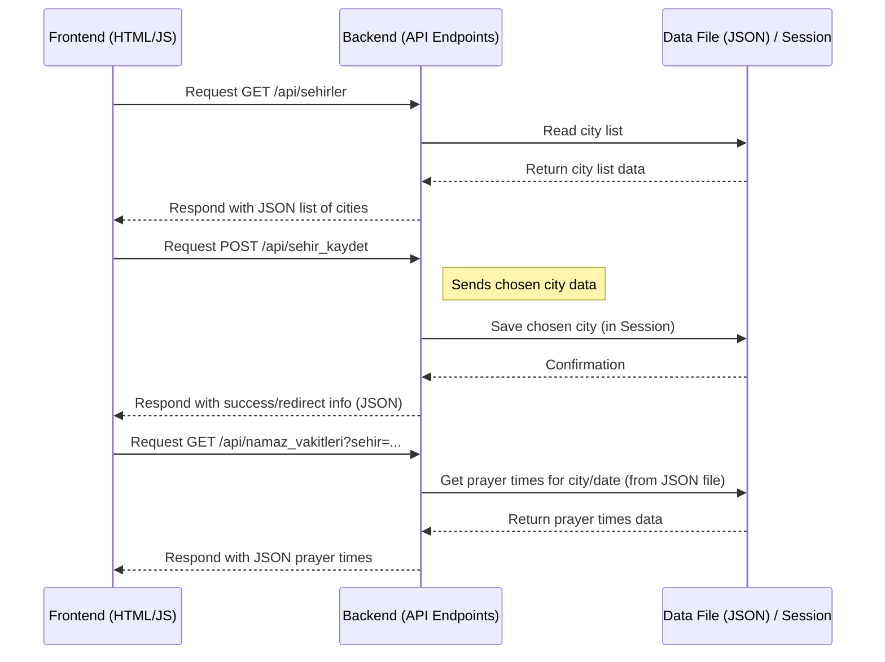

# Chapter 5: Backend API Endpoints

Welcome back! In the last chapter, [Chapter 4: User City and Preference Storage](04_user_city_and_preference_storage_.md), we learned how the application remembers important details about users, like their chosen city and notification settings, using a database (for the bot) or temporary storage (like browser sessions for the web).

But how do different parts of our application, especially the web frontend you see in your browser, *get* this data or tell the backend to *save* something, without reloading the entire page? This is where **Backend API Endpoints** come in!

### What Problem Are We Solving?

Imagine you're on the city selection page (`sehir-secimi.html`). The page needs to show you a list of all the available cities in Turkey and other countries. Where does this list come from? It needs to get it from the backend part of our application (the Flask app running on the server).

Similarly, when you click on a city on that page, the frontend needs to tell the backend, "Hey, this user chose Istanbul! Remember that."

We could build this by having every click load a whole new page, but that's slow and clunky. We want a smoother, faster experience where the frontend can fetch or send small pieces of information in the background.

This is exactly what **Backend API Endpoints** allow.

### What are Backend API Endpoints?

Think of our web application's backend (the Flask app) as a building with different services inside. **API Endpoints** are like specific **service windows** or doors on this building.

*   Each endpoint has a unique **address** (a URL path, usually starting with something like `/api/`).
*   Each endpoint is designed to perform a specific task when you make a **request** to its address.
*   When you make a request to an API endpoint, the backend processes it and sends back a **response**. Often, this response is just the raw data the frontend needs, formatted in a way that's easy for web pages to understand and use (like **JSON**).

The "API" part stands for **Application Programming Interface**. It's a set of rules and definitions that allows one software application (our frontend) to talk to another software application (our backend).

### How Frontend and Backend Talk (The Request-Response Model)

The conversation between the frontend (your browser) and the backend (our Flask app via API endpoints) follows a simple pattern:

1.  The frontend (JavaScript code running in your browser) sends a **Request** to a specific API endpoint URL.
2.  The backend (the Flask app) receives the request, looks at the URL, and runs the specific Python code function associated with that endpoint.
3.  This function does its job – maybe it reads data from the JSON file ([Chapter 3](03_prayer_time_data_handling_.md)), interacts with user storage ([Chapter 4 concept](04_user_city_and_preference_storage_.md)), or just prepares a simple list.
4.  The backend sends back a **Response**, which often contains the requested data in **JSON** format.
5.  The frontend receives the response and uses the data to update the page without a full reload.



This diagram shows how the frontend makes different types of requests (GET to ask for data, POST to send data) to specific endpoints, and how the backend processes these requests, interacts with data sources, and sends back responses, typically in JSON format.

### Key Concepts for API Endpoints

1.  **URL Path:** The specific address, like `/api/sehirler`.
2.  **HTTP Method:** This indicates the *type* of action the frontend wants to perform.
    *   `GET`: Used to **retrieve** data from the server. (e.g., "Give me the list of cities").
    *   `POST`: Used to **send** data to the server to create or update something. (e.g., "Here is the city the user chose, please save it").
3.  **JSON (JavaScript Object Notation):** This is the standard format for sending data back and forth between the frontend and backend in web APIs. It looks like Python dictionaries and lists and is very easy for JavaScript (and Python) to work with.

    Example JSON response for a city list:
    ```json
    [
      "Adana",
      "Adiyaman",
      "Afyonkarahisar",
      ...
    ]
    ```

    Example JSON response for prayer times:
    ```json
    {
      "imsak": "05:30",
      "gunes": "06:55",
      "ogle": "12:45",
      "ikindi": "15:50",
      "aksam": "18:30",
      "yatsi": "19:45"
    }
    ```

### Using API Endpoints in Our Project

Let's look at some actual API endpoints defined in our Flask application (`imsakiye.py`). These endpoints are used by the JavaScript code running on the frontend pages (`sehir-secimi.html`, `index.html`).

#### Example 1: Getting the List of Cities

The `sehir-secimi.html` page needs the list of cities to display to the user. It makes a `GET` request to the `/api/sehirler` endpoint.

Here's the simplified code in `imsakiye.py` that handles this request:

```python
# Inside imsakiye.py

@app.route('/api/sehirler') # The endpoint URL path
def sehirleri_getir():
    # This is a hardcoded list of cities in this project
    sehirler = [
        "Adana", "Adiyaman", "Afyonkarahisar", # ... many more cities ...
        "Zonguldak"
    ]
    # jsonify converts the Python list into a JSON response
    return jsonify(sehirler)
```

*   `@app.route('/api/sehirler')`: This Flask decorator defines the endpoint at `/api/sehirler`. Since no `methods` are specified, it defaults to handling `GET` requests.
*   `def sehirleri_getir():`: This Python function runs when a `GET` request is made to `/api/sehirler`.
*   `sehirler = [...]`: In this specific case, the list of cities is simply defined directly in the code. In a larger application, this might come from a database.
*   `return jsonify(sehirler)`: The crucial part for APIs! `jsonify` is a Flask helper function that takes a Python dictionary or list and converts it into a proper HTTP response with the content type set to `application/json`. The frontend JavaScript receives this JSON data.

The JavaScript on the `sehir-secimi.html` page uses the `fetch` function (or jQuery's `$.getJSON`) to call this endpoint and get the list, then dynamically adds the city buttons to the page.

#### Example 2: Getting Prayer Times via API

The JavaScript on the `index.html` page needs to fetch the current prayer times (e.g., to calculate the countdown) and potentially prayer times for other dates or countries. It makes a `GET` request to the `/api/namaz_vakitleri` endpoint, including parameters in the URL (like `?sehir=Istanbul&date=2025-03-01`).

Here's the simplified code in `imsakiye.py`:

```python
# Inside imsakiye.py (after defining namaz_vakitlerini_al_sehir)

@app.route('/api/namaz_vakitleri') # The endpoint URL
def namaz_vakitlerini_al_api():
    # Get parameters from the URL query string (like ?sehir=...)
    sehir = request.args.get('sehir')
    ulke = request.args.get('ulke')
    tarih = request.args.get('date') # Get the date parameter

    if not sehir and not ulke:
        # Return an error message if no city or country is provided
        return jsonify({'error': 'Sehir veya ulke bilgisi gerekli'}), 400

    try:
        if ulke:
            # Call the data handler function for countries (from Chapter 3 concept)
            vakitler = namaz_vakitlerini_al_ulke(ulke, tarih)
        else:
            # Call the data handler function for cities (from Chapter 3)
            vakitler = namaz_vakitlerini_al_sehir(sehir, tarih)

        # Return the prayer times data as JSON
        return jsonify({'vakitler': vakitler})
    except Exception as e:
        # Handle errors and return a JSON error response
        return jsonify({'error': str(e)}), 500
```

*   `@app.route('/api/namaz_vakitleri')`: Defines this endpoint. It's a GET endpoint by default.
*   `request.args.get(...)`: This Flask feature allows reading values from the URL's query string (the part after `?`).
*   `namaz_vakitlerini_al_ulke(...)` and `namaz_vakitlerini_al_sehir(...)`: These are the functions we discussed in [Chapter 3: Prayer Time Data Handling](03_prayer_time_data_handling_.md) that read the data from the JSON file. The API endpoint calls these functions to get the data it needs.
*   `return jsonify({'vakitler': vakitler})`: Packages the returned prayer times dictionary inside a JSON object with a key `vakitler` and sends it back.

The JavaScript on the frontend receives this JSON object and can then easily access the prayer times (e.g., `data.vakitler.imsak`) to update the display or perform calculations.

#### Example 3: Saving the Chosen City (Using POST)

When a user clicks a city on the `sehir-secimi.html` page, the frontend needs to send this choice to the backend to be remembered (in the browser's session for the web app). This is done with a `POST` request to the `/api/sehir_kaydet` endpoint.

Here's the simplified code in `imsakiye.py`:

```python
# Inside imsakiye.py

@app.route('/api/sehir_kaydet', methods=['POST']) # Specify POST method
def sehir_kaydet():
    # Get the JSON data sent in the request body
    data = request.get_json()
    sehir = data.get('sehir') # Get the 'sehir' value from the JSON

    if not sehir:
        return jsonify({'error': 'Sehir bilgisi gerekli'}), 400

    # Save the chosen city in the user's session (Chapter 4 concept for web)
    session['sehir'] = sehir

    # Return a JSON response, perhaps including a URL to redirect to
    return jsonify({'redirect': f'/sehir/{sehir}'})
```

*   `@app.route('/api/sehir_kaydet', methods=['POST'])`: Defines the endpoint and explicitly states it handles `POST` requests.
*   `request.get_json()`: This Flask function reads the incoming data from the request body, assuming it's in JSON format, and converts it into a Python dictionary.
*   `session['sehir'] = sehir`: This line uses Flask's built-in `session` object (part of the user preference concept for the web app in [Chapter 4](04_user_city_and_preference_storage_.md)) to store the chosen city temporarily for that specific user's browser.
*   `return jsonify({'redirect': f'/sehir/{sehir}'})`: Sends back a JSON response indicating success and providing a URL. The JavaScript on the frontend can read this `redirect` URL and navigate the browser to the specific city's page (`/sehir/Istanbul`).

There's a similar endpoint `/api/ulke_kaydet` for saving a chosen country.

### Where to find the Code

All the API endpoint definitions using `@app.route('/api/...')` and the logic within the corresponding functions (like `sehirleri_getir`, `namaz_vakitlerini_al_api`, `sehir_kaydet`, etc.) are located within the `imsakiye.py` file.

You can also find other API endpoints like `/api/sonraki_vakit` (used for the countdown on the main page), `/api/current_date`, and `/api/daily_content`, all following similar patterns of receiving requests and returning JSON responses.

### Conclusion

In this chapter, we learned about **Backend API Endpoints**. These are specific web addresses (`/api/...`) on our Flask backend that act like service windows. The frontend (JavaScript in the browser) uses these endpoints to make **Requests** (like `GET` for fetching data or `POST` for sending data) to get specific pieces of information or ask the backend to perform small tasks, without needing to load a whole new page. The backend processes these requests, often by calling other functions (like the data handling logic from [Chapter 3](03_prayer_time_data_handling_.md)), and sends back a **Response**, typically containing data formatted as **JSON**.

These APIs are essential for creating a dynamic and responsive web application where different parts can communicate efficiently in the background.

Now that we understand how the backend provides data and handles simple requests, let's look at how the Flask application builds the actual HTML pages that the user sees in their browser, using the data it has gathered or received.

[Frontend Templating](06_frontend_templating_.md)

---

<sub><sup>Generated by [AI Codebase Knowledge Builder](https://github.com/The-Pocket/Tutorial-Codebase-Knowledge).</sup></sub> <sub><sup>**References**: [[1]](https://github.com/yigitgulyurt/NamazVakitleri/blob/86f03bb599f007d4f20d1af54233bfd8de16b1d4/imsakiye.py), [[2]](https://github.com/yigitgulyurt/NamazVakitleri/blob/86f03bb599f007d4f20d1af54233bfd8de16b1d4/templates/index.html), [[3]](https://github.com/yigitgulyurt/NamazVakitleri/blob/86f03bb599f007d4f20d1af54233bfd8de16b1d4/templates/sehir-secimi.html)</sup></sub>
