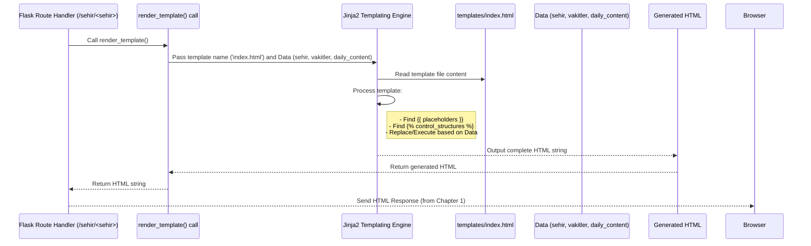

# Chapter 6: Frontend Templating

Welcome back! In our previous chapters, we've learned about the different ways users interact with our application ([Chapter 1: Web Application (Flask)](01_web_application__flask__.md) and [Chapter 2: Telegram Bot Application](02_telegram_bot_application_.md)), how we handle the crucial prayer time data ([Chapter 3: Prayer Time Data Handling](03_prayer_time_data_handling_.md)), how we remember user preferences ([Chapter 4: User City and Preference Storage](04_user_city_and_preference_storage_.md)), and how different parts of the application can talk to each other using API endpoints ([Chapter 5: Backend API Endpoints](05_backend_api_endpoints_.md)).

Now, let's focus on the web application again ([Chapter 1](01_web_application__flask__.md)). We know Flask handles requests and gets data. But how does it turn that data into the actual visual page you see in your browser – the headers, the prayer time table, the daily content, all laid out nicely?

This is where **Frontend Templating** comes in. It's the process our Flask application uses to build the final HTML page *before* sending it to your browser.

### What Problem Are We Solving?

Imagine you want to display prayer times for Istanbul on a web page. You need HTML code that looks something like this:

```html
<h1>Namaz Vakitleri</h1>
<h2>Istanbul</h2>
<table>
  <tr>
    <th>İmsak</th>
    <td>05:30</td>
  </tr>
  <tr>
    <th>Güneş</th>
    <td>06:55</td>
  </tr>
  <!-- ... other prayer times ... -->
</table>
<p>Today's content: ...</p>
```

If a user wants to see Ankara's times, the HTML would be almost exactly the same, but "Istanbul" would be replaced with "Ankara", and the times would be different.

It would be very repetitive and messy to write Python code that manually creates these HTML strings for *every* city and *every* day, putting the city name and prayer times directly into the Python code.

We need a better way to create HTML pages that are mostly the same but have small parts that change based on the data.

### The Solution: Using Templates

The core idea behind templating is simple:

*   **Create a blueprint:** You create a standard HTML file, but instead of putting the *actual* data (like "Istanbul" or "05:30"), you put **placeholders** where the dynamic data should go.
*   **Fill the blanks:** When a user requests a page (like for Istanbul), the Flask application gets the necessary data (like the city name and prayer times). It then takes the blueprint (the template file) and uses a **templating engine** to replace all the placeholders with the actual data.
*   **Send the result:** The templating engine outputs the complete, finished HTML code for that specific city and day, and Flask sends this HTML to the user's browser.

Think of it like a "fill-in-the-blanks" form letter. The main letter structure is fixed (the template), but you fill in the recipient's name, address, and specific details (the dynamic data) before printing and sending it.

In Flask, the default templating engine is called **Jinja2**. It's a powerful tool, but for our basic needs, we only need to understand how to put placeholders and simple logic in our HTML files.

### Key Concepts in Frontend Templating

1.  **Template Files:** These are usually standard HTML files, but they live in a special folder (by default, Flask looks inside a folder named `templates/`). They contain the fixed layout and structure of the web page. Example: `templates/index.html`.

2.  **Placeholders (Variables):** These are markers in the template file that tell the templating engine, "Put the value of this variable here." In Jinja2, these look like double curly braces: `{{ variable_name }}`.

    Example: Instead of `<h2>Istanbul</h2>`, you'd put `<h2>{{ sehir }}</h2>`. When Flask renders this template and passes `sehir="Ankara"`, the output HTML will be `<h2>Ankara</h2>`.

3.  **Control Structures:** Sometimes you need to do more than just display a variable. You might need to show something only if a condition is true, or repeat a section of HTML for every item in a list. Jinja2 uses curly braces and percent signs for these: ``.

    Example: To show daily content only if it exists:
    ```html
    
      <div class="daily-content">
        <!-- Display content here -->
      </div>
    
    ```
    Example: To loop through prayer times (though our template lists them manually for simplicity):
    ```html
    {# This is just an example, not in the project's index.html loop #}
    
      <p>{{ name }}: {{ time }}</p>
    
    ```
    (Note: `{# ... #}` is how you write comments in Jinja2 templates).

4.  **The `render_template()` function:** This is the Flask function you call in your Python code to tell Flask to use a template. You pass the name of the template file and any variables you want to make available to the template.

    Example: `return render_template('index.html', sehir=sehir, vakitler=vakitler)`

### How it Works: Rendering the City Page (`index.html`)

Let's revisit the `/sehir/<sehir>` route handler function from `imsakiye.py` (which we saw in [Chapter 1](01_web_application__flask__.md) and [Chapter 5](05_backend_api_endpoints_.md)):

```python
# Inside imsakiye.py

@app.route('/sehir/<sehir>')
def sehir_sayfasi(sehir):
    try:
        # Get dynamic data
        bugun = datetime.now().strftime('%Y-%m-%d')
        vakitler = namaz_vakitlerini_al_sehir(sehir, bugun) # Gets prayer times data (Chapter 3)
        daily_content = get_daily_content() # Gets daily content data (Chapter 7)

        # Use the template and pass the data
        return render_template(
            'index.html', # Name of the template file in the 'templates' folder
            sehir=sehir, # Pass the 'sehir' variable to the template
            vakitler=vakitler, # Pass the 'vakitler' dictionary
            daily_content=daily_content # Pass the 'daily_content' dictionary
        )
    except Exception as e:
        return str(e), 500
```

Here's what happens:

1.  When someone visits `/sehir/Istanbul`, the `sehir_sayfasi` function runs with `sehir` set to `"Istanbul"`.
2.  The function gets the prayer times data for "Istanbul" today (`vakitler`) by calling the function from [Chapter 3](03_prayer_time_data_handling_.md). Let's imagine `vakitler` is `{'imsak': '05:30', 'gunes': '06:55', ...}`.
3.  It also gets the `daily_content` data ([Chapter 7](07_daily_content_provider_.md)).
4.  `render_template('index.html', ...)` is called. This tells Flask:
    *   Find the file `templates/index.html`.
    *   Make the Python variable `sehir` (value "Istanbul") available in the template as a template variable named `sehir`.
    *   Make the Python dictionary `vakitler` (value `{'imsak': '05:30', ...}`) available as a template variable named `vakitler`.
    *   Make the Python dictionary `daily_content` available as a template variable named `daily_content`.
5.  The Jinja2 engine processes `templates/index.html`, replacing placeholders like `{{ sehir }}` with "Istanbul", `{{ vakitler.imsak }}` with "05:30", and processing any control structures based on the data (like the `` block).
6.  The final, complete HTML string is generated and returned by `render_template`.
7.  Flask sends this HTML string as the response to the user's browser.

Now let's look at simplified snippets from `templates/index.html` to see how it uses the data passed from Flask:

```html
{# Inside templates/index.html #}

<title>Namaz Vakitleri</title>

<body>
    <div class="container">
        <div class="header">
            <h1>Namaz Vakitleri</h1>
            <div class="header-buttons">
                <a href="/sehir-secimi" class="change-city-btn">
                    <i class="fas fa-exchange-alt"></i>
                    <span id="change-city-text">Şehir Değiştir</span>
                </a>
                {# Link to fullscreen page, using the 'sehir' variable #}
                <a href="/sehir/{{ sehir }}/tamekran" class="fullscreen-btn">
                    <i class="fas fa-expand"></i>
                    <span id="fullscreen-text">Tam Ekran</span>
                </a>
            </div>
        </div>

        <div class="imsakiye-container" id="prayerTimes">
            {# Display the city name using the 'sehir' variable #}
            <h2><i class="fas fa-city"></i> {{ sehir }} </h2>
            <div class="imsakiye-grid">
                <div class="imsakiye-box">
                    <h3>İmsak</h3>
                    {# Access prayer time data from the 'vakitler' dictionary #}
                    <span id="imsak">{{ vakitler.imsak }}</span>
                    <div class="countdown" id="imsak-countdown"></div>
                </div>
                <div class="imsakiye-box">
                    <h3>Güneş</h3>
                    {# Access another prayer time #}
                    <span id="gunes">{{ vakitler.gunes }}</span>
                    <div class="countdown" id="gunes-countdown"></div>
                </div>
                {# ... more imsakiye-box elements for other prayer times ... #}
            </div>
        </div>

        {# Use a control structure to check if daily_content exists #}
        
        <div class="daily-content fade-in">
            {# Access data from the 'daily_content' dictionary #}
            <div class="type">{{ daily_content.type|title }}</div>
            <div class="text">{{ daily_content.text }}</div>
            <div class="source">{{ daily_content.source }}</div>
            
            <div class="arabic">{{ daily_content.translation.ar }}</div>
            
        </div>
        
    </div>
    {# ... JavaScript code here ... #}
</body>
```

Notice how:

*   `{{ sehir }}` is used in the `<h2>` tag and the "Tam Ekran" link's `href`. Jinja2 replaces this with the actual city name ("Istanbul" or "Ankara").
*   `{{ vakitler.imsak }}` and `{{ vakitler.gunes }}` access specific values from the `vakitler` dictionary passed by Flask.
*   `` is a control structure that makes sure the `daily-content` `div` is only included in the final HTML if Flask passed `daily_content` data that is not empty or `None`.
*   `{{ daily_content.text }}` accesses values from the `daily_content` dictionary.
*   `{{ daily_content.type|title }}` shows a simple Jinja2 filter (`|title`) which capitalizes the first letter of the `type` string.

This shows how the template acts as a standard layout, and the Flask backend injects the specific data for each page request.

### Internal Flow of Templating

Let's visualize the templating step specifically:



This diagram highlights the core work done by `render_template` and the Jinja2 engine: taking the template blueprint and the dynamic data to produce the finished HTML ready for the browser.

The other template files in the `templates/` folder (`sehir-secimi.html`, `tam_ekran.html`, `offline.html`, `privacy_policy.html`, `open_in_browser.html`, `stats.html`) work on the same principle: they are HTML structures with placeholders and possibly control structures that are filled with data when Flask renders them using `render_template`. For example, `sehir-secimi.html` doesn't get prayer time data, but it uses JavaScript on the *frontend* to fetch the city list via an API ([Chapter 5](05_backend_api_endpoints_.md)) and build the city list *in the browser*. `tam_ekran.html` gets similar data to `index.html` but has a different layout.

### Where to find the Code

The Flask route handlers that call `render_template` are in the `imsakiye.py` file. Look for `@app.route(...)` decorated functions that end with `return render_template(...)`.

The HTML template files themselves are located in the `templates/` directory. You can open files like `templates/index.html` or `templates/sehir-secimi.html` to see the mix of standard HTML, `{{ variable }}` placeholders, and `` structures.

### Conclusion

In this chapter, we explored **Frontend Templating**, the process used by our Flask web application to dynamically build the HTML pages seen in your browser. We learned that templates are HTML files with placeholders, and Flask uses the Jinja2 engine and the `render_template()` function to fill these placeholders with dynamic data (like city name, prayer times, and daily content) gathered from the backend ([Chapter 3](03_prayer_time_data_handling_.md), [Chapter 4 concept](04_user_city_and_preference_storage_.md), [Chapter 7](07_daily_content_provider_.md), etc.). This allows the application to have a consistent page structure while displaying personalized or up-to-date information for each user and request.

Now that we've seen how the web pages are built, let's look closer at another source of dynamic information displayed on the page: the Daily Content Provider.

[Daily Content Provider](07_daily_content_provider_.md)

---

<sub><sup>Generated by [AI Codebase Knowledge Builder](https://github.com/The-Pocket/Tutorial-Codebase-Knowledge).</sup></sub> <sub><sup>**References**: [[1]](https://github.com/yigitgulyurt/NamazVakitleri/blob/86f03bb599f007d4f20d1af54233bfd8de16b1d4/imsakiye.py), [[2]](https://github.com/yigitgulyurt/NamazVakitleri/blob/86f03bb599f007d4f20d1af54233bfd8de16b1d4/templates/index.html), [[3]](https://github.com/yigitgulyurt/NamazVakitleri/blob/86f03bb599f007d4f20d1af54233bfd8de16b1d4/templates/offline.html), [[4]](https://github.com/yigitgulyurt/NamazVakitleri/blob/86f03bb599f007d4f20d1af54233bfd8de16b1d4/templates/open_in_browser.html), [[5]](https://github.com/yigitgulyurt/NamazVakitleri/blob/86f03bb599f007d4f20d1af54233bfd8de16b1d4/templates/privacy_policy.html), [[6]](https://github.com/yigitgulyurt/NamazVakitleri/blob/86f03bb599f007d4f20d1af54233bfd8de16b1d4/templates/sehir-secimi.html), [[7]](https://github.com/yigitgulyurt/NamazVakitleri/blob/86f03bb599f007d4f20d1af54233bfd8de16b1d4/templates/stats.html), [[8]](https://github.com/yigitgulyurt/NamazVakitleri/blob/86f03bb599f007d4f20d1af54233bfd8de16b1d4/templates/tam_ekran.html)</sup></sub>
