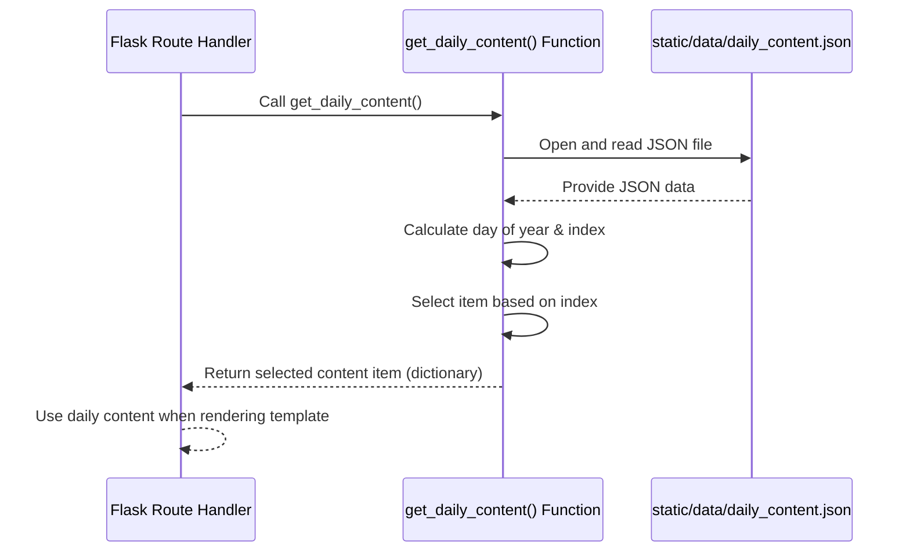

# Chapter 7: Daily Content Provider

Welcome back! In the last chapter, [Chapter 6: Frontend Templating](06_frontend_templating_.md), we saw how our Flask web application takes data – like the city name and prayer times – and uses templates to build the final HTML page displayed in your browser. On that page, you might have noticed a section with "Daily Content," perhaps a Quranic verse or a Hadith.

But where does that changing message come from? It's not hardcoded into the HTML template itself, because it changes every day!

This is the job of the **Daily Content Provider**.

### What Problem Are We Solving?

Imagine you want your website's main page to display a different inspiring message, like a quote or a small piece of religious text, *every single day*. You have a list of these messages ready.

The challenge is:

1.  You need a way to store all these messages.
2.  Every time someone visits the page on a specific day, you need to show *the same* message for that day, and then show a *different* one the next day.
3.  The web application needs to easily get the correct message for "today."

This is exactly what the Daily Content Provider helps us with. It's like having a special calendar page for each day that tells you which message from your list to display.

### The Role of the Daily Content Provider

This part of the code acts as a simple system for delivering fresh, relevant content to the main web page. Its main jobs are:

*   Holding a collection of inspiring content items.
*   Figuring out which item from the collection corresponds to the current day.
*   Providing that specific content item when asked.

Think of it as the "daily inspiration" service for the website.

### Where Does the Content Live?

Just like the prayer time data ([Chapter 3: Prayer Time Data Handling](03_prayer_time_data_handling_.md)), the daily content is stored in a structured file. In this project, it's a **JSON file** located at `static/data/daily_content.json`.

This file contains a list of content items. Each item is a small dictionary containing the text, its source, type (like "ayet" or "hadis"), and potentially translations.

Here's a simplified look at the structure inside `static/data/daily_content.json`:

```json
{
  "content": [
    {
      "type": "ayet",
      "text": "Oruç sizden önce...",
      "source": "Bakara 2:183",
      "translation": {
        "en": "Fasting is prescribed...",
        "ar": "يَا أَيُّهَا الَّذِينَ آمَنُوا كُتِبَ عَلَيْكُمُ الصِّيَامُ..."
      }
    },
    {
      "type": "hadis",
      "text": "Cennet'in sekiz kapısından biri...",
      "source": "Buhârî, Savm, 4",
      "translation": {
        "en": "There is a gate in Paradise...",
        "ar": "إن في الجنة بابا يقال له الريان..."
      }
    },
    // ... many more content items ...
  ]
}
```

The file contains a main object with one key, `"content"`, which holds a list (`[...]`) of these content dictionaries.

### How it Works: Selecting the Day's Content

The core logic is deciding *which* item from the list to show today. The `get_daily_content()` function in `imsakiye.py` does this.

It uses a clever trick: it takes the **day number of the year** (Day 1 is January 1st, Day 60 is March 1st, etc.) and uses the **modulo operator (`%`)** with the *total number of items* in the content list.

The modulo operator gives you the remainder after a division. For example, `60 % 5` is `0` (because 60 divided by 5 is 12 with a remainder of 0), and `61 % 5` is `1`.

If you have 5 content items in your list (at index 0, 1, 2, 3, 4):
*   On Day 60 of the year, `60 % 5 = 0`. The code picks the item at index 0.
*   On Day 61 of the year, `61 % 5 = 1`. The code picks the item at index 1.
*   On Day 62, `62 % 5 = 2`. Index 2.
*   On Day 63, `63 % 5 = 3`. Index 3.
*   On Day 64, `64 % 5 = 4`. Index 4.
*   On Day 65, `65 % 5 = 0`. Index 0 again!

This way, the content cycles through the list based on the day of the year, providing a different item each day until the end of the list is reached, and then it starts over.

### The Code: The `get_daily_content` Function

The `get_daily_content()` function is responsible for reading the JSON file and selecting the correct content based on the current day.

Here's the simplified function from `imsakiye.py`:

```python
import json
import os
from datetime import datetime

# (Other imports and Flask setup are here...)

# APP_ROOT variable helps find the file path
APP_ROOT = os.path.dirname(os.path.abspath(__file__))

def get_daily_content():
    try:
        # 1. Find the full path to the JSON file
        json_dosya_yolu = os.path.join(APP_ROOT, 'static/data/daily_content.json')

        # 2. Open and read the JSON file
        with open(json_dosya_yolu, 'r', encoding='utf-8') as file:
            content_data = json.load(file)

        # 3. Check if the 'content' list exists and is not empty
        if not content_data or 'content' not in content_data or not content_data['content']:
             print("Hata: Günlük içerik dosyası boş veya hatalı.")
             return None # Or return a default message

        # 4. Get the day of the year and calculate the index
        day_of_year = datetime.now().timetuple().tm_yday # Get the day number (1 to 365/366)
        total_content_items = len(content_data['content'])
        content_index = (day_of_year - 1) % total_content_items # Calculate index (0-based)

        # 5. Get the content item at the calculated index
        return content_data['content'][content_index]

    except Exception as e:
        print(f"Error loading daily content: {e}")
        # 6. Return a default or None in case of error
        return {
            "type": "Hata",
            "text": "Günlük içerik yüklenemedi.",
            "source": "",
            "translation": {}
        }
```

Let's break it down:

1.  **Finding the File:** `os.path.join(APP_ROOT, 'static/data/daily_content.json')` builds the correct path to the content file.
2.  **Reading the Data:** `with open(...) as file:` opens the file, and `json.load(file)` reads the contents and turns it into a Python dictionary called `content_data`.
3.  **Checking Content:** It makes sure the file wasn't empty or formatted incorrectly.
4.  **Calculating Index:**
    *   `datetime.now().timetuple().tm_yday` gets the current day of the year (e.g., 60 for March 1st).
    *   `total_content_items = len(content_data['content'])` counts how many items are in the list.
    *   `(day_of_year - 1) % total_content_items` does the main calculation. We subtract 1 from `day_of_year` because list indexes start at 0, but `tm_yday` starts at 1. The modulo `%` gives us the correct index within the range of the list length.
5.  **Getting the Item:** `content_data['content'][content_index]` accesses the list of content items and picks the one at the calculated `content_index`. This item (a dictionary) is then returned.
6.  **Error Handling:** If anything goes wrong (file not found, JSON is bad, etc.), it catches the error and returns a simple error message or `None` instead of crashing.

This function encapsulates all the logic for providing the daily content.

### How it Connects to the Web Page

This `get_daily_content()` function is called by the Flask route handlers in `imsakiye.py` that are responsible for rendering the main web pages.

For example, the `sehir_sayfasi` function (which handles the `/sehir/<sehir>` route, discussed in [Chapter 1](01_web_application__flask__.md) and [Chapter 6](06_frontend_templating_.md)) calls `get_daily_content()` to get the data:

```python
# Inside imsakiye.py (snippet from sehir_sayfasi function)

@app.route('/sehir/<sehir>')
def sehir_sayfasi(sehir):
    try:
        # ... code to get prayer times ...

        # Get daily content here!
        daily_content = get_daily_content() # Call the function

        # Pass the daily_content data to the template
        return render_template(
            'index.html',
            sehir=sehir,
            vakitler=vakitler,
            daily_content=daily_content # This is passed to the template
        )
    except Exception as e:
        return str(e), 500
```

As you can see, the result of `get_daily_content()` is stored in the `daily_content` variable and then passed to the `render_template` function. In [Chapter 6](06_frontend_templating_.md), we saw how the `templates/index.html` file uses `` and `{{ daily_content.text }}` to check for and display this content on the page.

### Internal Flow of Getting Daily Content

Let's visualize the steps when a web page requests daily content:



This diagram shows how the Flask route asks the `get_daily_content` function for the data, the function reads the file, performs the selection logic, and returns the single chosen item back to the route handler.

### Where to find the Code

The Python code for the `get_daily_content` function is in the `imsakiye.py` file.

The list of content items is stored in the `static/data/daily_content.json` file.

The HTML template that uses this data is `templates/index.html`.

### Conclusion

In this chapter, we learned about the **Daily Content Provider**, which is the part of our web application responsible for providing a different inspirational message each day. We saw that the content is stored in the `static/data/daily_content.json` file, and the `get_daily_content()` function reads this file, uses the day of the year and the modulo operator to select an item, and provides this item to the Flask route handlers. The templates then use this data to display the daily content on the main web page.

This simple system ensures that the website's main page offers fresh, cycling content without needing manual updates every day.

Next, we'll shift our focus back to the Telegram bot and explore how it can send timely reminders for prayer times using a Scheduled Notification System.

[Scheduled Notification System](08_scheduled_notification_system_.md)

---

<sub><sup>Generated by [AI Codebase Knowledge Builder](https://github.com/The-Pocket/Tutorial-Codebase-Knowledge).</sup></sub> <sub><sup>**References**: [[1]](https://github.com/yigitgulyurt/NamazVakitleri/blob/86f03bb599f007d4f20d1af54233bfd8de16b1d4/imsakiye.py), [[2]](https://github.com/yigitgulyurt/NamazVakitleri/blob/86f03bb599f007d4f20d1af54233bfd8de16b1d4/static/data/daily_content.json), [[3]](https://github.com/yigitgulyurt/NamazVakitleri/blob/86f03bb599f007d4f20d1af54233bfd8de16b1d4/templates/index.html), [[4]](https://github.com/yigitgulyurt/NamazVakitleri/blob/86f03bb599f007d4f20d1af54233bfd8de16b1d4/templates/tam_ekran.html)</sup></sub>
