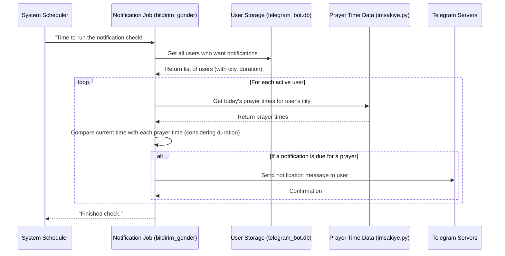

# Chapter 8: Scheduled Notification System

Welcome to the final chapter of our journey through the NamazVakitleri project! In the previous chapters, we've explored the different ways you can interact with the project ([Chapter 1: Web Application (Flask)](01_web_application__flask__.md) and [Chapter 2: Telegram Bot Application](02_telegram_bot_application_.md)), where the prayer time data comes from ([Chapter 3: Prayer Time Data Handling](03_prayer_time_data_handling_.md)), how we remember your preferences like your city and notification settings ([Chapter 4: User City and Preference Storage](04_user_city_and_preference_storage_.md)), how the web parts talk to each other ([Chapter 5: Backend API Endpoints](05_backend_api_endpoints_.md)), how web pages are built ([Chapter 6: Frontend Templating](06_frontend_templating_.md)), and even how we get the daily inspirational messages ([Chapter 7: Daily Content Provider](07_daily_content_provider_.md)).

Now, let's look at a really useful feature of the Telegram bot: the **Scheduled Notification System**.

### What Problem Are We Solving?

Imagine you want to be reminded about prayer times a few minutes before they happen. You could set a regular alarm on your phone, but the prayer times change slightly every day! You'd have to update your alarm constantly, which is a hassle.

The **Scheduled Notification System** solves this problem. It's designed to automatically check the current time against the prayer times for *your chosen city* and send you a reminder message right in Telegram when a prayer time is approaching, based on *your preferred notification duration*.

Think of it as your personal, smart prayer time alarm clock that knows today's schedule and rings exactly when you want it to before each prayer.

### How Does It Work?

Since the bot isn't constantly active listening for *your* specific timing request, it needs a mechanism to wake up periodically and check *everyone's* schedule. This involves a few key ideas:

1.  **A Scheduler:** A system component that is set up to run a specific task automatically at regular intervals (like once every minute).
2.  **A Task (Job):** The code that the scheduler runs. This task is responsible for checking the time and sending notifications.
3.  **Access to User Preferences (from Chapter 4):** The task needs to know which users have notifications enabled, what their chosen city is, and how many minutes before the prayer they want to be notified. This information is read from the database.
4.  **Access to Prayer Time Data (from Chapter 3):** The task needs to get today's exact prayer times for each user's city. This is done by using the data handling functions.
5.  **Comparison Logic:** The core brain of the task. It compares the current time to *each* prayer time for *each* active user, considering their notification duration.
6.  **Sending Messages (from Chapter 2):** If the comparison logic determines that a notification is due for a specific user and prayer time, the task uses the Telegram bot library to send a message to that user.

### High-Level Flow

Here's a simplified idea of what happens, for example, every minute:



This diagram shows how the scheduler triggers the job, which then fetches necessary data and sends messages only when the specific time criteria are met for each user.

### The Code: Setting up the Scheduler and the Job

In our project, the Telegram bot code (`telegram_bot.py`) uses the `APScheduler` library (although the core logic is handled within the standard `python-telegram-bot`'s `job_queue` which wraps `APScheduler`) to run scheduled tasks.

The main part where the scheduling is set up is in the `main()` function in `telegram_bot.py`.

```python
# Inside telegram_bot.py -> main() function

# ... other setup code ...

# Bildirim gönderme işini her dakika kontrol et
job_queue = application.job_queue # Get the job queue object
job_queue.run_repeating(bildirim_gonder, interval=60, first=0)
logger.info("✅ Bildirim sistemi aktif edildi")

# Bot'u başlat
logger.info("🤖 Bot hazır! Ctrl+C ile kapatabilirsiniz.")
application.run_polling()
```

*   `job_queue = application.job_queue`: This line gets the job scheduling component from the main bot `application` object.
*   `job_queue.run_repeating(bildirim_gonder, interval=60, first=0)`: This is the core scheduling command.
    *   `bildirim_gonder`: This is the name of the Python function that will be executed repeatedly. This function contains the logic for checking and sending notifications.
    *   `interval=60`: This tells the scheduler to run the `bildirim_gonder` function every 60 seconds (every minute).
    *   `first=0`: This tells the scheduler to run the job immediately when the bot starts, and then every 60 seconds after that.

So, this small piece of code sets up the "clock" that ticks every minute and triggers our notification logic.

### The Code: The Notification Logic (`bildirim_gonder`)

The heavy lifting happens inside the `async def bildirim_gonder(context: CallbackContext):` function, which is the function called by the scheduler every minute.

Let's look at simplified parts of this function to understand its steps:

```python
# Inside telegram_bot.py

import pytz
from datetime import datetime, timedelta
from imsakiye import namaz_vakitlerini_al_sehir # Import function from Chapter 3

# Türkiye saat dilimi (Important for timing!)
TURKEY_TZ = pytz.timezone('Europe/Istanbul')

async def bildirim_gonder(context: CallbackContext):
    """Namaz vakitlerine göre bildirim gönderir"""
    try:
        # 1. Get users who want notifications (from Chapter 4)
        conn = get_db_connection() # Function from Chapter 4
        users = conn.execute('SELECT * FROM users WHERE bildirim_aktif = 1').fetchall()
        conn.close()

        # Get current time in the correct timezone
        now = datetime.now(TURKEY_TZ)

        # 2. Loop through each user
        for user in users:
            sehir = user['sehir']
            bildirim_suresi = user['bildirim_suresi'] or 5 # Get duration (default 5)
            
            if not sehir or sehir not in SEHIRLER:
                # Skip users without a valid city
                continue 

            # 3. Get today's prayer times for the user's city (from Chapter 3)
            bugun = now.strftime('%Y-%m-%d')
            prayer_times = namaz_vakitlerini_al_sehir(sehir, bugun) # Function from Chapter 3

            # 4. Check each prayer time for this user
            for vakit_key, time_str in prayer_times.items():
                if time_str == "null" or vakit_key == 'gunes': # Skip non-times or Gunes
                    continue

                try:
                    # 5. Convert prayer time string to a datetime object
                    # Combine today's date with the prayer time's hour/minute
                    vakit_time_today = now.replace(
                        hour=int(time_str.split(':')[0]), # Get hour part
                        minute=int(time_str.split(':')[1]), # Get minute part
                        second=0, microsecond=0
                    )

                    # 6. Calculate the target time for the notification
                    bildirim_zamani = vakit_time_today - timedelta(minutes=bildirim_suresi) # Subtract duration

                    # 7. Check if the current time is close to the notification time
                    # We check if 'now' is between 'bildirim_zamani' and 'bildirim_zamani + 1 minute'
                    if bildirim_zamani <= now < bildirim_zamani + timedelta(minutes=1):
                        # 8. If yes, send the notification message!
                        vakit_adi = { # Friendly names for prayer times
                            'imsak': 'İmsak', 'ogle': 'Öğle', 'ikindi': 'İkindi',
                            'aksam': 'Akşam', 'yatsi': 'Yatsı'
                        }[vakit_key]

                        message = (
                            f"⏰ {vakit_adi} vaktine {bildirim_suresi} dakika kaldı!\n"
                            f"📍 {sehir}\n"
                            f"🕒 Vakit: {time_str}"
                        )

                        # Send to the user (Chapter 2 concept)
                        await context.bot.send_message(chat_id=user['user_id'], text=message)

                        # Also send to linked group if applicable
                        if user['grup_id']:
                             try:
                                await context.bot.send_message(chat_id=user['grup_id'], text=message)
                             except Exception as e:
                                # Log group sending errors but don't stop
                                logger.error(f"Grup mesajı gönderilirken hata oluştu: {e}")

                except Exception as e:
                    # Log errors for a single prayer time check but continue with others
                    logger.error(f"Vakit ({vakit_key}) kontrol edilirken hata oluştu: {e}")

    except Exception as e:
        # Log overall errors for the job
        logger.error(f"Bildirim gönderilirken hata oluştu: {e}")

```

Let's break down the important parts:

1.  **Get Active Users:** It connects to the database (`telegram_bot.db` from [Chapter 4](04_user_city_and_preference_storage_.md)) and fetches all users who have `bildirim_aktif` set to 1. This is efficient as it only checks users who want notifications.
2.  **Loop Through Users:** The code then processes each user who was found.
3.  **Get Prayer Times:** For the current user, it calls `namaz_vakitlerini_al_sehir()` ([Chapter 3](03_prayer_time_data_handling_.md)) to get today's prayer times for their specific city.
4.  **Check Each Prayer:** It loops through the dictionary of prayer times (`imsak`, `gunes`, `ogle`, etc.).
5.  **Convert Time:** The prayer times from the JSON file are strings (like `"05:30"`). To compare them with the current time, they are converted into `datetime` objects using `datetime.strptime`. This step also combines the time with *today's* date using `now.replace(...)`. It's important to handle time zones correctly here using `pytz` (`TURKEY_TZ`) so comparisons are accurate.
6.  **Calculate Notification Time:** `timedelta(minutes=bildirim_suresi)` creates a duration object. Subtracting this from the prayer time `datetime` object gives the exact `datetime` when the notification *should* be sent.
7.  **Check If Now is Notification Time:** The core logic! `if bildirim_zamani <= now < bildirim_zamani + timedelta(minutes=1):` checks if the *current* time (`now`) falls within the 60-second window starting exactly at `bildirim_zamani`. This makes sure the notification is sent very close to the desired time (e.g., exactly 5 minutes before, or within 1 minute of that time due to the job running every minute).
8.  **Send Message:** If the condition in step 7 is true, a message string is created, and `await context.bot.send_message(chat_id=user['user_id'], text=message)` is called. This function from the `python-telegram-bot` library (seen in [Chapter 2](02_telegram_bot_application_.md)) sends the message to the specified `chat_id` (which is the user's unique ID from the database). It also checks if the user has linked the bot to a group and sends the message there too.

This entire process runs every minute, quietly in the background, ensuring that timely notifications are sent to everyone who has requested them.

### Where to find the Code

The code for the Scheduled Notification System is primarily located within the `telegram_bot.py` file:

*   The scheduler setup (`job_queue.run_repeating(...)`) is in the `main()` function.
*   The notification checking and sending logic is in the `async def bildirim_gonder(...)` function.

This function also relies on the database interaction functions (`get_db_connection`) from the [Chapter 4: User City and Preference Storage](04_user_city_and_preference_storage_.md) concepts and the prayer time fetching function (`namaz_vakitlerini_al_sehir`) from the [Chapter 3: Prayer Time Data Handling](03_prayer_time_data_handling_.md) concepts.

### Conclusion

In this final chapter, we explored the **Scheduled Notification System** within the Telegram bot. We learned that it uses a **scheduler** to run a specific **job** (`bildirim_gonder`) repeatedly (every minute). This job fetches data from the user **database** (Chapter 4) and the prayer time **data handler** (Chapter 3), performs **time comparisons** based on the user's notification duration preference, and uses the **Telegram bot library** (Chapter 2) to send timely reminder messages for approaching prayer times.

This system brings together several concepts from previous chapters to provide a proactive and personalized notification service, making the bot a truly helpful assistant for keeping track of prayer times.

We have now covered all the main components of the NamazVakitleri project, from the web interface and Telegram bot to data handling, user preferences, APIs, templating, daily content, and scheduled notifications.

---

<sub><sup>Generated by [AI Codebase Knowledge Builder](https://github.com/The-Pocket/Tutorial-Codebase-Knowledge).</sup></sub> <sub><sup>**References**: [[1]](https://github.com/yigitgulyurt/NamazVakitleri/blob/86f03bb599f007d4f20d1af54233bfd8de16b1d4/telegram_bot.py)</sup></sub>
