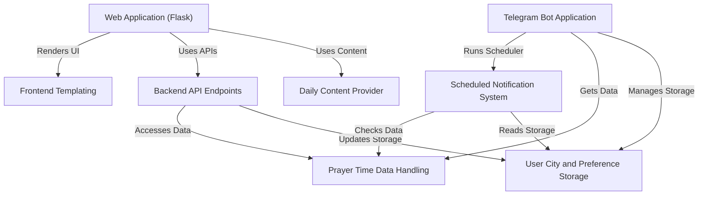

# Tutorial: NamazVakitleri

This project helps you keep track of **prayer times**. It provides a *website* where you can view daily times for different cities and see inspiring **daily content**. There is also a *Telegram bot* that allows you to get times and set **notification reminders** for your chosen city.

## Visual Overview

## Chapters

1. [Web Application (Flask)
](01_web_application__flask__.md)
2. [Telegram Bot Application
](02_telegram_bot_application_.md)
3. [Prayer Time Data Handling
](03_prayer_time_data_handling_.md)
4. [User City and Preference Storage
](04_user_city_and_preference_storage_.md)
5. [Backend API Endpoints
](05_backend_api_endpoints_.md)
6. [Frontend Templating
](06_frontend_templating_.md)
7. [Daily Content Provider
](07_daily_content_provider_.md)
8. [Scheduled Notification System
](08_scheduled_notification_system_.md)

---

Generated by [AI Codebase Knowledge Builder](https://github.com/The-Pocket/Tutorial-Codebase-Knowledge).
